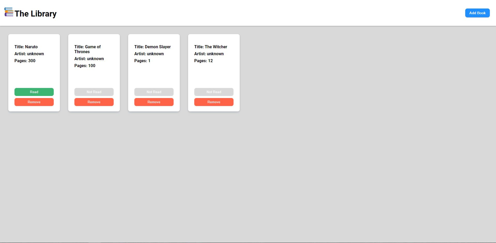
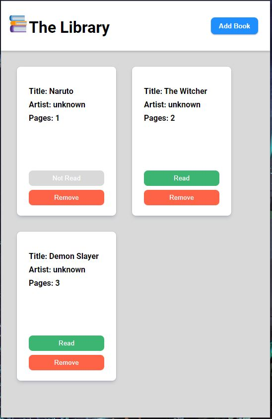

# TheOdinProject - Book Library Project

This is a project solution for the Book Library project from TheOdinProject via
https://www.theodinproject.com/paths/full-stack-javascript/courses/javascript/lessons/library 

## Table of contents

- [Overview](#overview)
  - [Screenshot](#screenshot)
  - [Links](#links)
  - [Built with](#built-with)
  - [What I learned](#what-i-learned)
  - [Continued development](#continued-development)
  - [Useful resources](#useful-resources)
- [Author](#author)


## Overview


### Screenshot





### Links

- Solution URL: [https://github.com/TheLegend760/Library-Project-TheOdinProject]
- Live Site URL: [https://kev-library-project-theodinproject.netlify.app/]

## My process

### Built with

- Semantic HTML5 markup
- CSS custom properties
- Flexbox
- Vanilla Javascript


### What I learned

I learned how to add objects onto arrays using object constructors and how to make it function on a website using books that can be added on a library. I also learned that on .innerHTML method you can add tags on it. I learned on how to pass values on form onto the array and how to use event.target to delete divs by clicking a certain tag that matches to what you want to be clicked to delete the div. 


```js
// Deletes the book div by clicking remove button with the remove class
function deleteBox(e) {
    const item = e.target;
    if(item.classList[0] === 'remove') {
        item.parentElement.parentElement.remove();
    }
};


// If check box is checked it puts the book that is inputed as read
    const readCheckbox = document.querySelector('#haveRead');
    if(readCheckbox.checked == true) {
        book.haveRead();
    } else {
        book.notRead();
    }

// Finds the array that matches the input and deletes it from the array
    function deleteBook() {
    let book = myLibary.findIndex(a => a.title == title);
    myLibary.splice(book,1);
};
```


### Continued development

I would like to do more projects on Object Constructors and prototypal inheritance. I got the basic of it, but I know with more practice I can get it down easier. I would also want to make my code look more cleaner. Based on my experience I feel like it looks sloppy, but once I get it down. I can try to redo this project to make it cleaner.

### Useful resources

- [https://www.youtube.com/watch?v=JaMCxVWtW58&t=1093s] - This video helped guide on how to create the object and attach it to an array. Layout if different than mine and he did a few things that I have not learned yet. So I had to figure ways to match it to the knowledge I know and apply it to my project. Thank you Traversy Media!


- [https://www.youtube.com/watch?v=Ttf3CEsEwMQ&t=1370s] - This video from Dev Ed allowed me to figure out how to delete the book div for using the remove button. He
taught me how to use the event.target. Thank you!


## Author

- GitHub - [TheLegend760](https://github.com/TheLegend760)
- Twitter - [@CodeKevo](https://www.twitter.com/CoderKevo)


